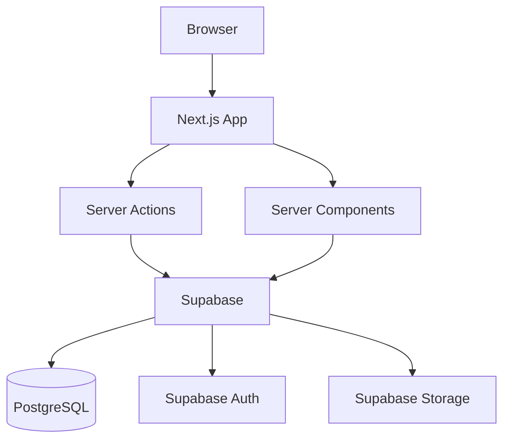

# Architecture — [Nom du projet]

<!-- INSTRUCTIONS : Ce document est généré par /tm-plan (phase 3) depuis le PRD.
     Les sections "Invariants" sont pré-remplies avec la stack Tiple Method.
     Les sections "À remplir" sont spécifiques au projet. -->

**Dernière MAJ :** [date]

## 1. Vue d'ensemble

<!-- Diagramme Mermaid haut niveau de l'architecture -->



## 2. Stack technique

<!-- INVARIANT — ne pas modifier sans ADR -->

| Techno | Version | Rôle | Justification |
|--------|---------|------|---------------|
| Next.js | 15 (App Router) | Framework fullstack | SSR/SSG, Server Components, Server Actions |
| TypeScript | 5.x (strict) | Typage | Sécurité du code, autocomplétion, refactoring |
| Supabase | Cloud | BaaS | Auth, PostgreSQL, RLS, Realtime, Storage |
| Tailwind CSS | 4.x | Styling | Utility-first, purge auto |
| Shadcn/ui | latest | Composants UI | Copy-paste, accessibles, Radix-based |
| Zod | 3.x | Validation | Schemas partagés front/back |
| React Hook Form | 7.x | Formulaires | Performance, intégration Zod |
| Vitest | latest | Tests unit/integ | Rapide, compatible ESM |
| Playwright | latest | Tests E2E | Cross-browser, auto-wait |
| pnpm | 9.x | Package manager | Rapide, strict |

## 3. Structure du projet

<!-- INVARIANT — structure standard Tiple Method -->

```
src/
├── app/                          # Routes Next.js (App Router)
│   ├── (auth)/                   # Pages publiques (login, signup)
│   ├── (dashboard)/              # Pages authentifiées
│   └── api/                      # Route handlers (webhooks uniquement)
├── components/
│   ├── ui/                       # Composants Shadcn/ui
│   ├── shared/                   # Composants métier réutilisables
│   └── [feature]/                # Composants spécifiques à une feature
├── hooks/                        # Custom hooks
├── lib/
│   ├── actions/                  # Server Actions (par parcours)
│   ├── schemas/                  # Zod schemas partagés
│   ├── supabase/                 # Clients Supabase (server.ts, client.ts)
│   └── utils/                    # Fonctions utilitaires pures
├── types/                        # Types TypeScript partagés
└── middleware.ts                  # Auth middleware
```

## 4. Modèle de données

<!-- À REMPLIR — spécifique au projet -->

```mermaid
erDiagram
    %% Ajouter les tables et relations du projet
```

### Tables

<!-- Pour chaque table :
| Colonne | Type | Nullable | Default | Description |
|---------|------|----------|---------|-------------|
-->

### RLS Policies

<!-- Pour chaque table, lister les policies RLS :
| Table | Policy | Opération | Condition |
|-------|--------|-----------|-----------|
-->

## 5. Server Actions

<!-- À REMPLIR — lister les actions par parcours -->

### [Parcours]
| Action | Input (Zod) | Output | Description |
|--------|-------------|--------|-------------|

## 6. Canal MCP (si applicable)

<!-- À REMPLIR si le produit expose un serveur MCP. Sinon écrire "N/A".
     Règle de parité : chaque tool = adaptateur fin vers le même service que la Server Action.
     Patterns : .tiple/conventions/mcp-patterns.md (tag mcp) -->

### Tools
| Tool | Input (Zod) | Effet | Widget associé | Parcours |
|------|-------------|-------|----------------|----------|

### Widgets (MCP Apps)
| Widget | Données affichées | Actions (tools appelés) |
|--------|-------------------|-------------------------|

### Auth MCP
<!-- OAuth 2.1 : authorization server retenu, mapping token → {userId, orgId, role} -->

## 7. Auth & Sécurité

<!-- INVARIANT — pattern standard Tiple Method -->

### Flux d'authentification
- Supabase Auth (email/password par défaut, extensible OAuth)
- Middleware Next.js : refresh token + redirect si non authentifié
- Server Actions : toujours revérifier auth (le middleware ne suffit pas)

### RLS
- Activé sur TOUTE table, sans exception
- Le service_role client est interdit sauf cas documenté (ADR)
- Chaque nouvelle table = nouvelles policies RLS

### Sécurité applicative
- Validation Zod côté serveur (jamais faire confiance au client)
- Pas de secrets dans le code client (NEXT_PUBLIC_ = public)
- Rate limiting sur les actions sensibles

## 8. Infrastructure & Déploiement

<!-- À REMPLIR — spécifique au projet -->
- **Hébergement :** <!-- Vercel, Coolify, Docker... -->
- **Supabase :** <!-- Cloud, self-hosted -->
- **CI/CD :** <!-- GitHub Actions, etc. -->
- **Environnements :** <!-- dev, staging, prod -->

## Invariants

Ces choix ne changent JAMAIS sans ADR documenté :
- Next.js 15 App Router (pas Pages Router)
- TypeScript strict mode
- Supabase pour auth + DB + RLS
- Server Actions pour les mutations
- Zod pour toute validation
- Migrations SQL versionnées

## Flexible

Ces choix peuvent être modifiés par projet sans ADR :
- Composants Shadcn installés
- Provider d'emails
- Provider de paiement
- State management client
- Stratégie de cache
- Déploiement
